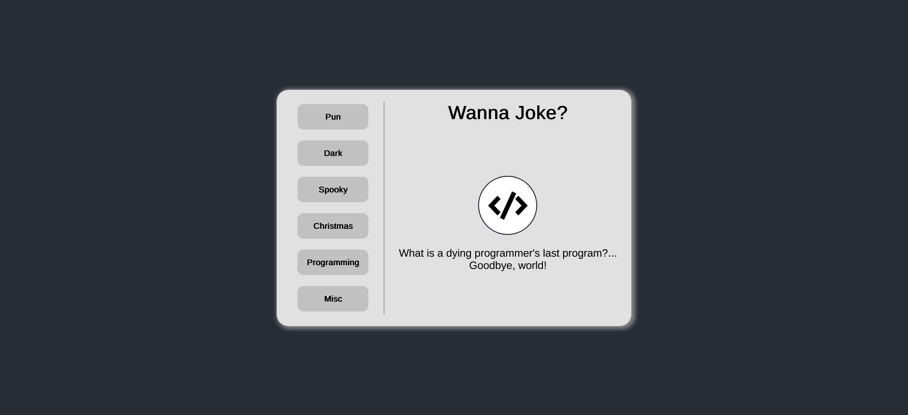

# Personal Project (React JS) - Random Joke Generator

This is my Personal Project and my first React App

## Table of contents

- [Overview](#overview)
  - [Screenshot](#screenshot)
  - [Links](#links)
- [My process](#my-process)
  - [Built with](#built-with)
- [Author](#author)

## Overview

This is a Random Joke component to get jokes from this [joke](https://sv443.net/jokeapi/v2/) API. Made this to start my journey of learning React JS.

### Screenshot

### Links

- Submission URL: [Github Repo](https://github.com/fritzadelbertus/DAP-Pokedex)
- Live Site URL: [Github Pages](https://fritzadelbertus.github.io/DAP-Pokedex/)

## My process

### Built with

- Flexbox
- Mobile First Design
- React

## Author

- Website - [Fritz Adelbertus Sitindaon](https://www.furitsu.site)
- LinkedIn - [Fritz Adelbertus](https://www.linkedin.com/in/fritzadelbertus/)

